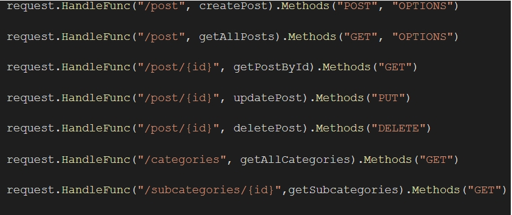
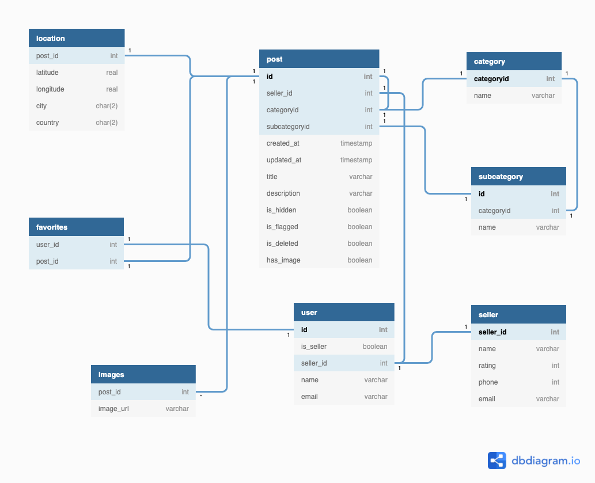
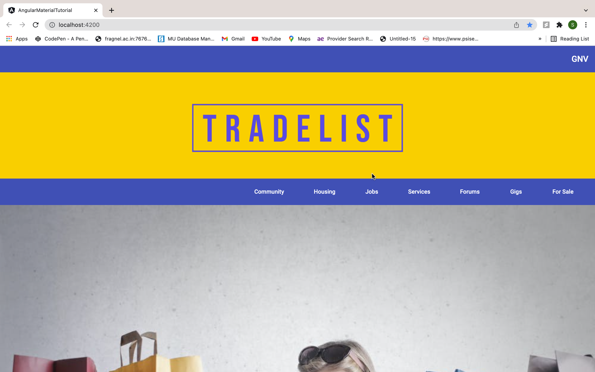
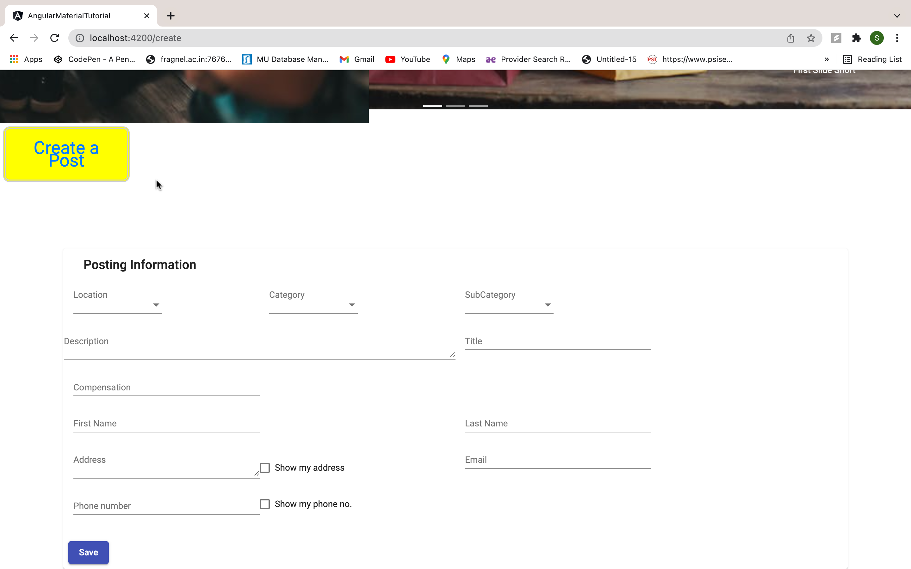
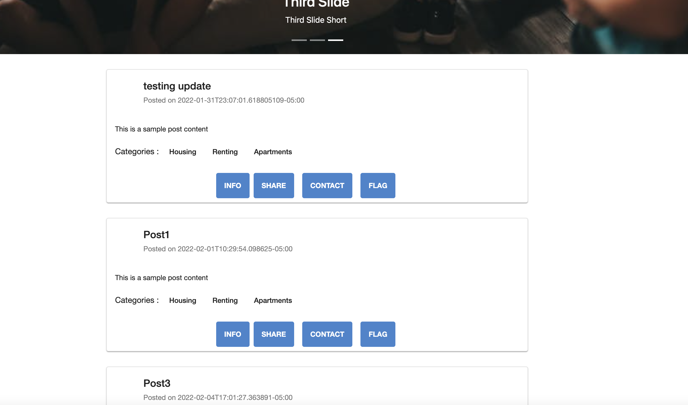

## Project : Tradelist (Sprint 1)
* Contributers : Siju Sakaria, Yashasvi Mutteneni, Mansi Singh, Sharwari Marathe

## Backend 
The programming language used is Golang. ORM library for Golang used is GORM and the database used is SQLite. 

API Endpoint document : 
[API](https://github.com/siju-s/TradeList/blob/9379afa66ad9ba4b1be4fcad9e74c1686457d103/Docs/API.md)

Following are the endpoints created:

DB schema :

* createPost : This endpoint can create a post using the HTTP POST method. We pass the request using Postman on localhost 8081 and pass the data as JSON. Once the request is sent the Post will be created and the data is sent to the database (stored in posts table).
* getAllPosts : This endpoint is used to retrieve all the posts that have been created. We pass the request using the HTTP GET request in Postman on localhost 8081. Once the request is sent all the posts are retrieved from the database 
* getPostById : Similar to getAllPosts but allows us to retrieve specific posts by including the ID of the post. 
* updatePost : This endpoint is used to make changes to existing posts. We use the HTTP PUT method and include the ID of the post that will pass the request using PostMan. Once the request is sent the post will be updated in the database. 
* deletePost : This endpoint is used to delete an existing post by passing a HTTP DELETE request on the postman with the ID of the post. The post will be deleted from the database after the request is sent. 
* getAllCategories : This endpoint displays all the existing categories of posts. We can view the categories by passing a HTTP GET request on Postman.
* getSubcategories : This endpoint displays the existing subcategories of posts. We can view the subcategories by passing a HTTP GET request and the ID of the category. 

## Frontend
All of these components are developed using Angular and Material.
* Toolbar and Logo Component : The toolbar and logo components use Material UI components like MatToolbarModule and MatIconModule for displaying the Website logo and City.

* Navbar Component : The Navbar component uses the MatMenuModule for displaying the menu and the submenus. This component displays all the categories listed on the website, while the drop down displays the subcategories.
* Advertisement Component : The advertisement component uses the Ngb-Carousel component. This component will display the potential ads on the website in order to gain more audience and make them aware of the recent offers.

* Create Post component :This makes use of the MatCard Module, MatFormFieldModule, MatSelectModule, Form Builder and other such angular material components. A reactive form page was built, which took information such as Location of the posting, description, category and sub category of posting, name, address and contact information of the person creating the post. Essentially it takes all the information required in a systematic manner. This data is further saved into the database. The posting is displayed on the front end as well. 

* View Post Component : The view post component uses material UI components like MatCardModule and MatButtonModule for the card layout. This component will display the posts that the end user has created using the Create Post Component Form. The View Post component displays the name, description, categories, images along with the contact information of the user who has created the posting. It also allows the user to share and flag the posting in case they want to forward it to someone or find it inappropriate. This component receives data from the backend and displays the contents in a card format. 
The following screenshot displays the data entered by the user from the create post component :

## Demo Links: 
https://github.com/siju-s/TradeList/blob/e53f112267c53db21df3ee259fb68a33aeb8d99a/Demos/sprint1_frontend_demo.mp4
https://github.com/siju-s/TradeList/blob/e53f112267c53db21df3ee259fb68a33aeb8d99a/Demos/sprint1_backend_demo.mp4
