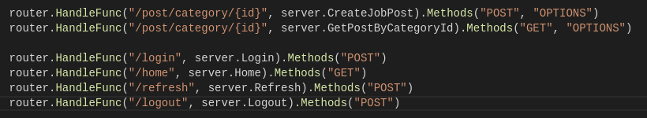
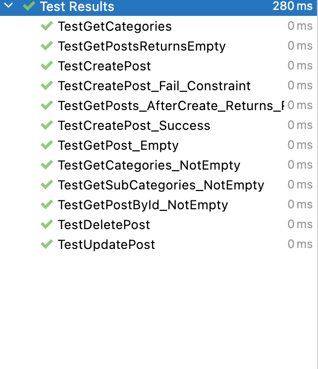
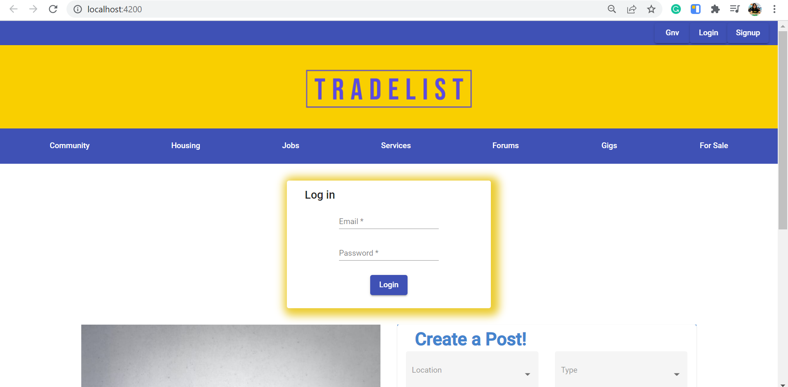
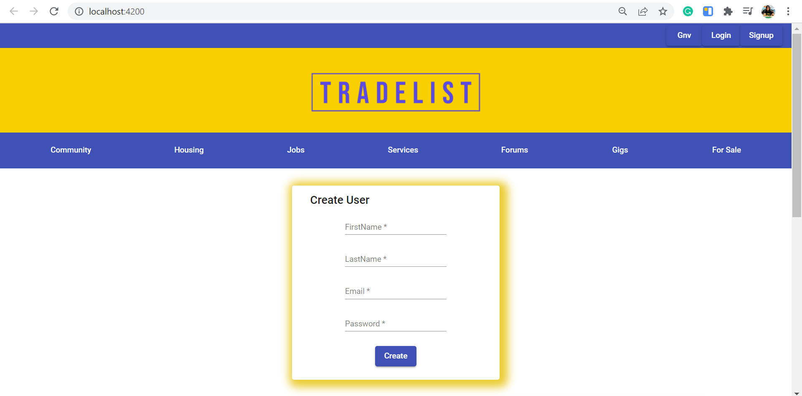
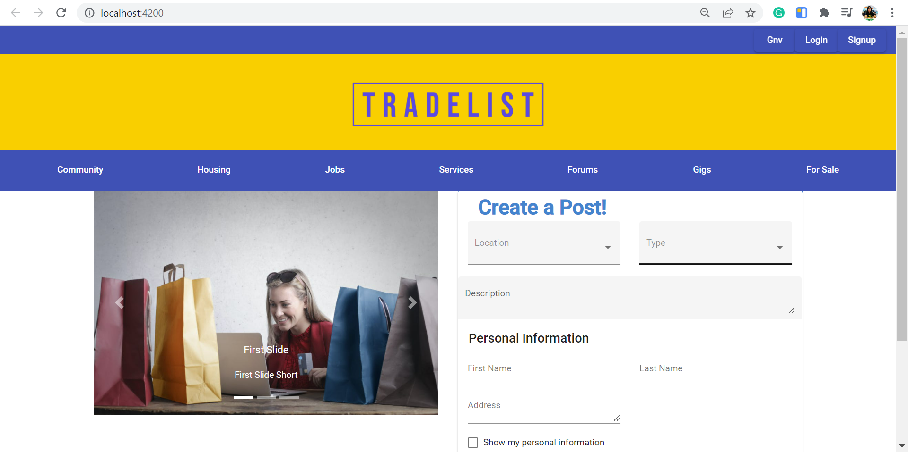

## Project : Tradelist (Sprint 2)
* Contributors : Siju Sakaria, Yashasvi Mutteneni, Mansi Singh, Sharwari Marathe

## Backend 
The programming language used is Golang. ORM library for Golang used is GORM and the database used is SQLite.

Following are the endpoints created:

* CreateJobPost: This endpoint is used to create a job post. It uses the HTTP POST method. Once the request is sent, the job details will be stored in the database. 
* GetPostByCategoryId: This endpoint is used to retrieve the job post based on the job category ID. It uses the HTTP GET method. Once the request is sent the job post will be retrieved from the database.
* Login: This endpoint is used to log the user into the webpage using the username and password entered by the user. If the user enters the correct credential they will be logged in and a token will be created with an expiration time. This endpoint uses the HTTP POST method.
* home: This endpoint retrieves the token and displays a welcome message if the token is valid. It uses the HTTP GET method.
* refresh: This endpoint is used to create a new token. A new token will be issued only if the old one is within 30 seconds of expiry. It uses the HTTP POST method.
* logout: This endpoint deletes the token and the user is logged out. It uses the HTTP POST method. 

* Unit tests and API tests have been added for the backend

## Frontend
All of these components are developed using Angular and Material.
* Login Form component : The login form is used for authenticating returning users, this component is developed using Material and Angular. It uses material components such as MatCard Module, MatFormFieldModule, MatSelectModule, Form Builder. 

* Create User Component : The create user form is used for registering new users, this component was also developed using the same components mentioned above. Users can toggle between the two forms depending on their requirement.

* Grid Component :
* Index Page : The index page contains all the components that we have developed tp this date. This is a rough sketch of how out website would look like in the end. End to end user testing and unit testing was performed on each component. 
* View Post Component : The view post component uses material UI components like MatCardModule and MatButtonModule for the card layout. This component will display the posts that the end user has created using the Create Post Component Form. The View Post component displays the name, description, categories, images along with the contact information of the user who has created the posting. It also allows the user to share and flag the posting in case they want to forward it to someone or find it inappropriate. This component receives data from the backend and displays the contents in a card format.

