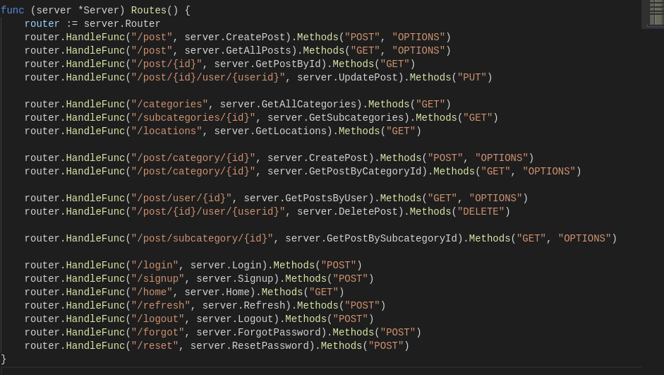
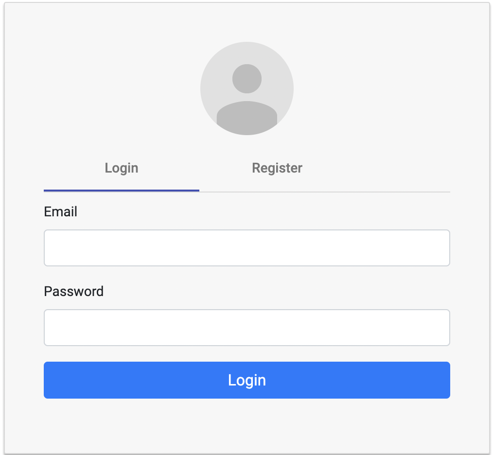
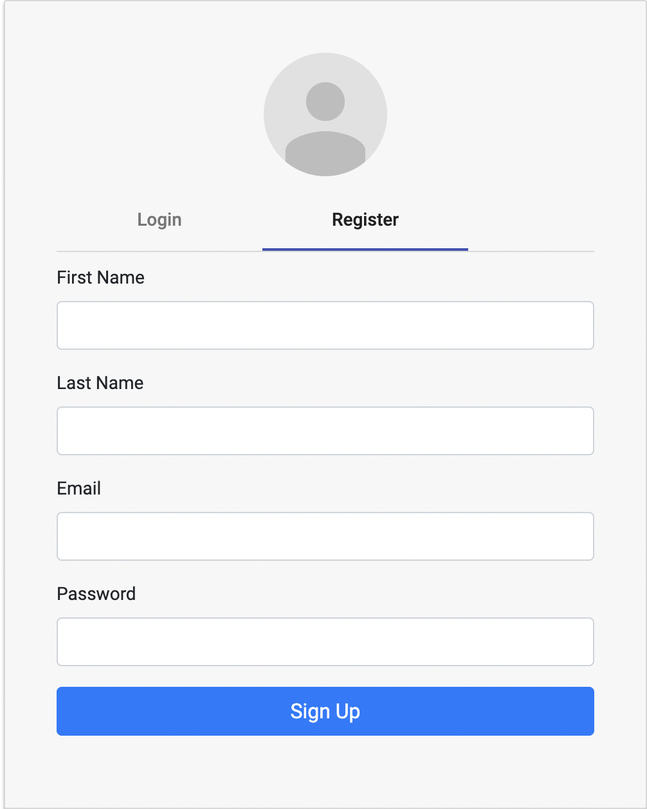
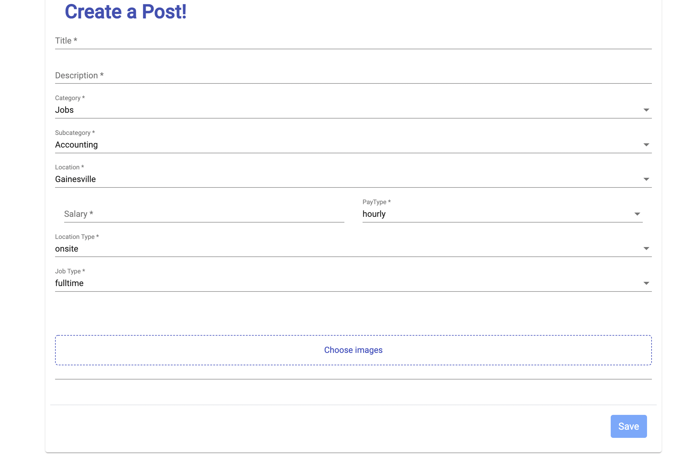
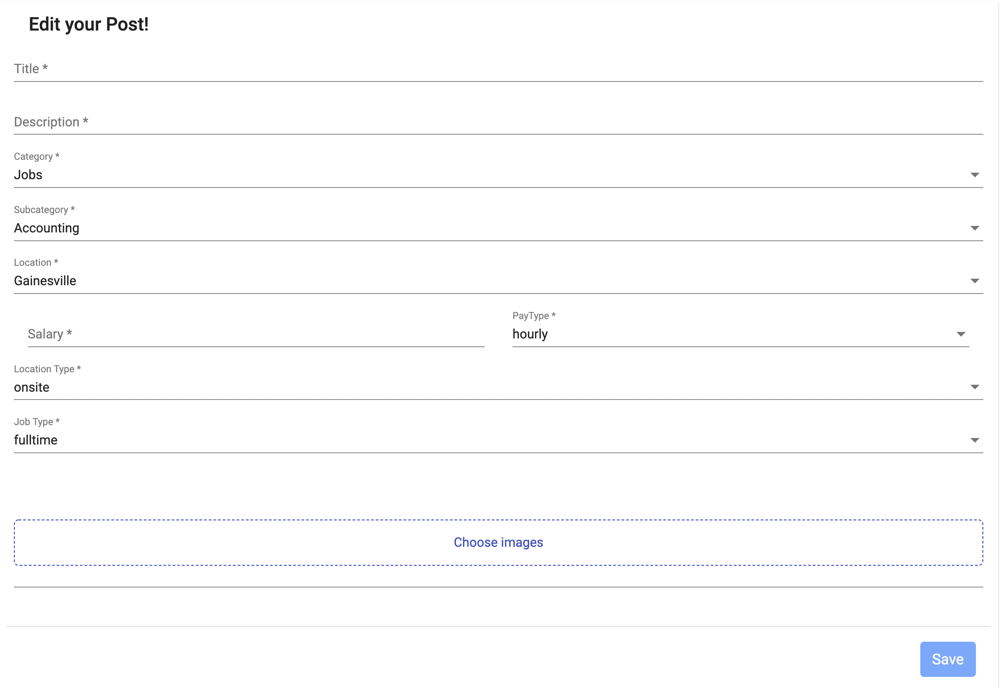
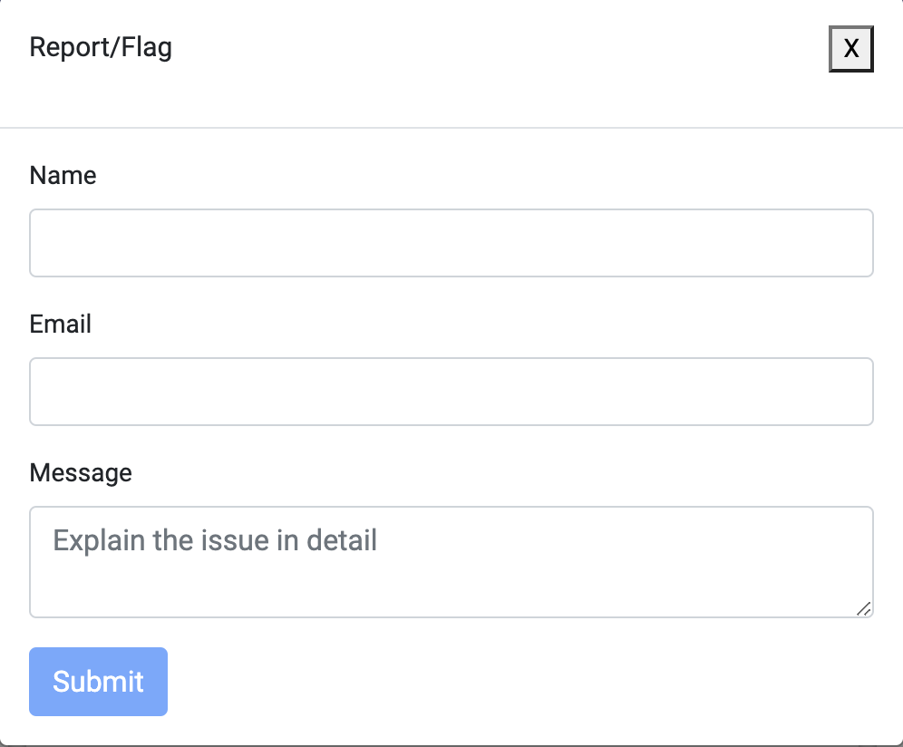
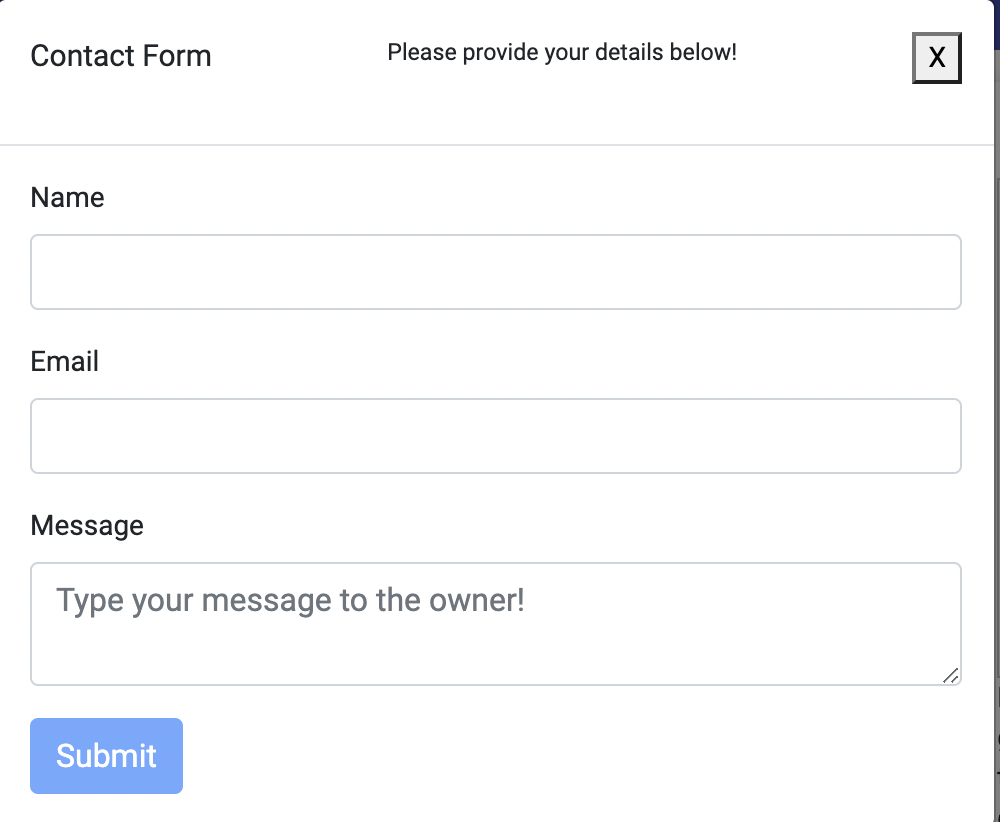

## Project : Tradelist (Sprint 4)
* Contributors : Siju Sakaria, Yashasvi Mutteneni, Mansi Singh, Sharwari Marathe

<!-- START doctoc generated TOC please keep comment here to allow auto update -->
<!-- DON'T EDIT THIS SECTION, INSTEAD RE-RUN doctoc TO UPDATE -->
**Table of Contents**  *generated with [DocToc](https://github.com/thlorenz/doctoc)*

- [Backend](#backend)
- [Frontend](#frontend)

<!-- END doctoc generated TOC please keep comment here to allow auto update -->

## Backend 
The programming language used is Golang. ORM library for Golang used is GORM and the database used is SQLite.

Endpoints: 

* `post/category/{id}`: This endpoint is used to create a post based on category id or fetch the post using HTTP POST or GET request. 
   Once the request is sent, the post details will be stored in the database.
* `post`:This endpoint is used to get all the posts stored in DB
* `categories`:This endpoint is used to get all the post categories
* `subcategories/{id}`:This endpoint is used to get all the post subcategories for a post category
* `login`: This endpoint is used to log the user into the webpage using the username and password entered by the user. If the user enters the correct credential they will be logged in and a token will be created with an expiration time. This endpoint uses the HTTP POST method.
* `home`: This endpoint retrieves the token and displays a welcome message if the token is valid. It uses the HTTP GET method.
* `refresh`: This endpoint is used to create a new token. A new token will be issued only if the old one is within 30 seconds of expiry. It uses the HTTP POST method.
* `logout`: This endpoint deletes the token and the user is logged out. It uses the HTTP POST method.
* `signup`: This endpoint is used to create a new user using HTTP POST
* `forgot`: This endpoint is used to complete the forgot password request. An email is sent to user with login link
* `reset`: This endpoint is used to reset the password

* Unit tests and API tests have been added for the backend

## Frontend
All of these components are developed using Angular and Material.

`Index Page :` The index page contains all the components that we have developed tp this date. This is a rough sketch of how out website would look like in the end. End to end user testing and unit testing was performed on each component.

`Login Form component :` The login form is used for authenticating returning users, this component is developed using Material and Angular. It uses material components such as MatCard Module, MatFormFieldModule, MatSelectModule, Form Builder.

`Create User Component :` The create user form is used for registering new users, this component was also developed using the same components mentioned above. Users can toggle between the two forms depending on their requirement.

`Search bar for Grid Component :` The Search bar contains the fields through which the posts will be filtered. This component uses the Ng2SearchPipeModule which creates a filter and allows filtering based on the search keywords.

`Grid/List View :` This allows the users to view the created posts in both grid and view format. This is a good feature as the users will not have to scroll further down and can view a good number of posts in a single view.

`Contact Form :` This form is used by users visiting the page for viewing posts. The users can use this form to contact the owner who posted the ad. This form uses the ReactiveFormsModule to ensure form validation.

`Report/Flag Form :` Like the name suggests the Report/Flag form can be used by the users to report inappropriate posts. This ensures that all the posts on the website are age and public appropriare. The form uses the Reactive Forms Module for form validation.

`User Profile :` Displays the posts that have been created by user. It uses material components such as MatCard Module, MatFormFieldModule, MatSelectModule, Form Builder

`Edit post :` The post created by user can be edited. It uses material components such as MatCard Module, MatFormFieldModule, MatSelectModule, Form Builder. 
Delete post : The post created by user can be deleted. It uses material components such as MatCard Module, MatFormFieldModule, MatSelectModule, Form Builder. 

Cypress Test cases for Create Post, Login, Signup Forms
Login Form 

Sign up Form 

Create Post Functionality 

 
Edit Post

Report page

Contact us page

